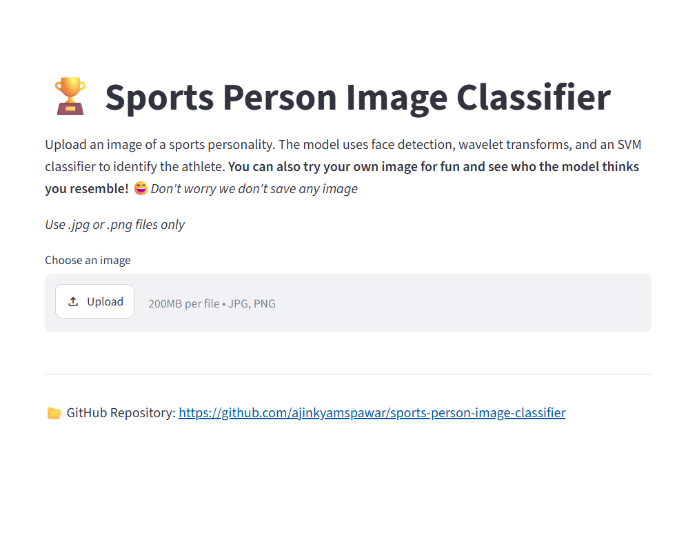
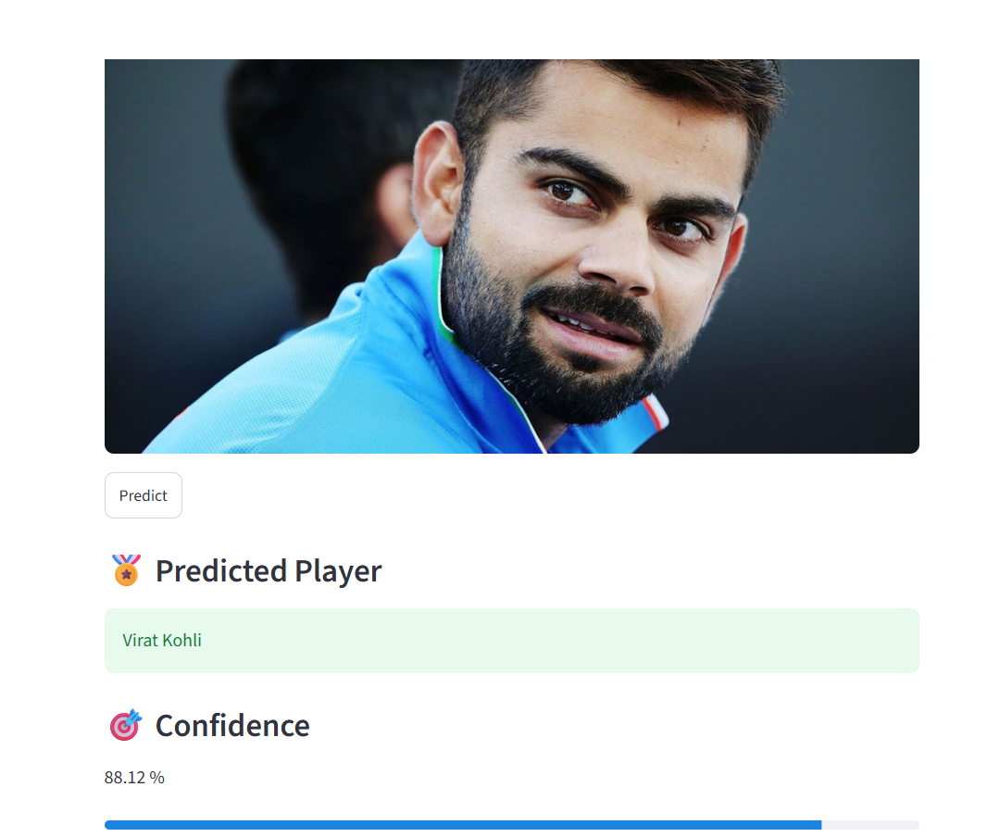
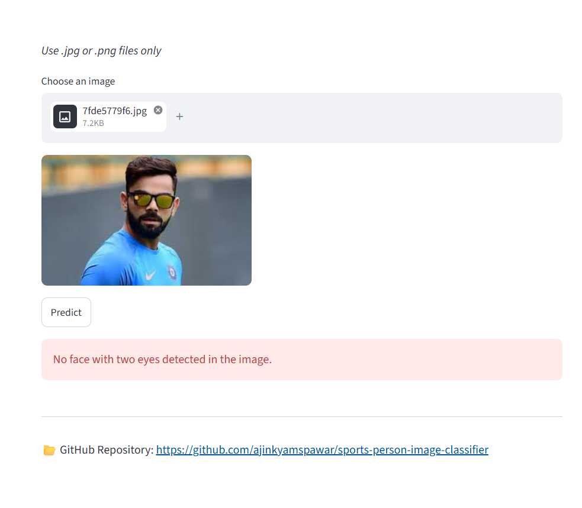

# 🏆 Sports Person Image Classifier

A machine learning web application that identifies a sports personality from an uploaded image using **face detection**, **wavelet transforms**, and an **SVM classifier**. The project is built with **Python**, **OpenCV**, **Scikit-learn**, and **Streamlit**, and is deployed on **Streamlit Community Cloud**.

---

## 🚀 Live Demo

**Streamlit App:**
https://sports-person-image-classifier.streamlit.app/
---

## 📂 GitHub Repository

[View Source Code](https://github.com/ajinkyamspawar/sports-person-image-classifier)

---

## 📌 Project Overview

This project classifies images of sports personalities by extracting facial features from uploaded images and passing them through a trained machine learning model.

The application performs the following steps:

1. Detects the face in the uploaded image
2. Checks whether at least **two eyes** are visible
3. Crops the face region
4. Creates image features using:

   * raw pixel values
   * wavelet transformed image features
5. Uses a trained **Support Vector Machine (SVM)** classifier to predict the sports person
6. Displays the predicted player and confidence score in a Streamlit web app

---

## 🎯 Problem Statement

The objective of this project is to build an end-to-end machine learning system that can identify a sports personality from an image and make the model accessible through a simple web interface.

This project demonstrates:

* image preprocessing
* feature engineering
* classical machine learning model building
* model serialization
* deployment of an ML application to the cloud

---

## 🧠 Sports Personalities Included

The classifier is trained to recognize the following sports personalities:

* Lionel Messi
* Maria Sharapova
* Serena Williams
* Virat Kohli
* Roger Federer

---

## 🛠️ Tech Stack

### Languages & Libraries

* Python
* NumPy
* OpenCV
* PyWavelets
* Scikit-learn
* Joblib
* Streamlit

### Tools & Platforms

* Git
* GitHub
* Streamlit Community Cloud
* VS Code / Jupyter Notebook

---

## ⚙️ How the Model Works

### 1. Face and Eye Detection

OpenCV Haar Cascade classifiers are used to detect:

* frontal faces
* eyes

Only images containing a face with **at least two detected eyes** are considered valid for prediction.

---

### 2. Feature Engineering

For each valid cropped face image:

#### A. Raw Image Features

* face image resized to **32 × 32**
* raw pixel values extracted

#### B. Wavelet Features

* wavelet transform applied using **PyWavelets**
* transformed image resized to **32 × 32**

#### C. Final Feature Vector

The raw image features and wavelet features are combined into a single feature vector of **4096 features**.

---

### 3. Model Training

A **Support Vector Machine (SVM)** classifier is trained on the engineered feature vectors and saved as:

* `saved_model.pkl`

The class labels are stored in:

* `class_dictionary.json`

---

## 📁 Project Structure

```bash
sports-person-image-classifier/
│
├── app.py
├── util.py
├── saved_model.pkl
├── class_dictionary.json
├── requirements.txt
├── .gitignore
├── TempSelfProject_Sports-person-image-classification-using-machine-learning.ipynb
├── haarcascade_eye.xml
├── haarcascade_frontalface_default.xml
└── images/
    ├── home_page.png
    ├── prediction_result.png
    └── error_case.png
```

---

## 🖥️ Streamlit App Features

* Upload image of a sports personality
* Preview uploaded image
* Predict player name
* Display confidence score
* Show progress bar
* Handle invalid cases such as side-face or group images where two eyes are not detected

---

## 📸 Application Screenshots

### Home Page



### Successful Prediction



### Error Handling / Edge Case



---

## ▶️ How to Run Locally

### 1. Clone the repository

```bash
git clone https://github.com/ajinkyamspawar/sports-person-image-classifier.git
cd sports-person-image-classifier
```

### 2. Create and activate a virtual environment

```bash
python -m venv venv
venv\Scripts\activate
```

### 3. Install dependencies

```bash
pip install -r requirements.txt
```

### 4. Run the Streamlit app

```bash
streamlit run app.py
```

---

## 📦 Requirements

```txt
streamlit
numpy
opencv-python-headless
PyWavelets
scikit-learn
joblib
```

---

## 🧪 Testing Observations

The deployed application was tested on multiple types of images:

### Worked well for:

* clear frontal images of trained sports personalities
* most individual player images

### Rejected correctly for:

* side-face images
* group photos
* images where two eyes were not detected

### Fun observations:

* when non-player personal images were uploaded, the model still predicted the closest matching sports personality with lower confidence

---

## ⚠️ Known Limitations

* The model is trained on only a small set of sports personalities
* Haar cascades may fail on profile images or complex group photos
* Prediction confidence for unknown faces can be low or inconsistent
* The system is based on classical ML features and not deep learning embeddings

---

## 🔮 Future Improvements

Possible future enhancements:

* Add **Top-3 predictions**
* Increase dataset size
* Support more sports personalities
* Use modern face detection methods
* Replace classical feature engineering with **CNN / deep learning-based embeddings**
* Improve UI and analytics

---

## 🚀 Deployment

The application is deployed using **Streamlit Community Cloud**.

### Deployment issue encountered

While deploying, OpenCV raised the following cloud error:

```bash
ImportError: libGL.so.1: cannot open shared object file
```

### Resolution

Replaced:

```txt
opencv-python
```

with:

```txt
opencv-python-headless
```

in `requirements.txt`.

---

## 🙏 Acknowledgement

This project was inspired by a machine learning project walkthrough shared by the **Codebasics** YouTube channel.  
I used the project idea as a learning reference and implemented, tested, debugged, and deployed the application as part of my hands-on machine learning practice.

## 👨‍💻 Author

**Ajinkya Pawar**

GitHub: [ajinkyamspawar](https://github.com/ajinkyamspawar)

---

## 📜 License

This project is for educational and portfolio purposes.
